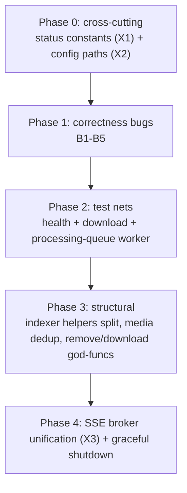

# Backend Refactor Roadmap

Codebase-wide assessment (May 2026) of `backend/internal/*` and `backend/shared/*`,
ranking packages by refactor urgency and listing concrete actions. This follows the
clean rewrite of `internal/requests` (see `docs/requests-remove-hardlink-fixes.md`),
which established the target conventions: centralized status/type constants, deduped
handlers/repos, cohesive files, and tests at the package boundary.

Treat this as the working backlog. Correctness bugs come first, then test nets, then
structural cleanup.

## Priority ranking

| Rank | Package | Severity | One-line reason |
|------|---------|----------|-----------------|
| 1 | `internal/health` | High | Zero tests on complex FS/registry logic; a dead-code exclusion bug; stub API check |
| 2 | `internal/indexer` | High | 447-line `helpers.go` god-file; likely inverted FileList freeleech filter; thin tests |
| 3 | `internal/media` | High | Inconsistent show-scope queries + duplicate `Show` inserts (correctness); 9 dead repo methods |
| 4 | `internal/download` | High | Zero tests; hardcoded download paths; 108-line `processDownload` |
| 5 | `internal/remove` | Medium | 127-line `Process`; 6 near-identical walk helpers (but well-tested) |
| 6 | `shared/processing-queue` | Medium | Sound core; untested worker/recovery; duplicated enqueue paths |
| 7 | `internal/qbittorrent` | Medium | Duplicate SSE broker; possible hash-key normalization bug |
| 8 | `internal/search` | Medium | Magic constants; dead code; cache maps never evict |
| 9 | `internal/sse` | Low | Clean; only debt is broker duplication with qbit |

---

## Likely real bugs (fix before cosmetics)

These are correctness issues surfaced during the review, not style nits.

### B1. FileList freeleech filter inverted
`backend/internal/indexer/filelist/indexer.go:46-49` skips items where `Freeleech == 1`,
but `pickBestFreeleechMovie` (`internal/indexer/helpers.go:128`) *requires* `Freeleech == 1`.
Net effect: FileList torrents can never be selected as "best freeleech".

### B2. Media show-scope query mismatch
`FindShowEntryIDsByShowAndScope` (used by requests dedup) omits NULL filters when
season/episode are nil, while `FindMediaIDsByShowScope` treats nil as `IS NULL`
(`internal/media/repository.go:285-290` vs `:200-208`). A full-show request
(`season=0, episode=0` → nil) dedups against *any* entry for the show+quality, but the
download-retry lookup matches only NULL/NULL entries. Inconsistent semantics.

### B3. `createShow` always inserts a new `Show`
`CreateShowEntryWithMedia` (`internal/media/repository.go:159-170`) unconditionally
`tx.Create(show)` despite `FindShowByExternalIDOrName` existing. Multiple episode
downloads can produce duplicate `Show` rows for the same IMDB/TVDB id.

### B4. Health FS-audit zone dead code
`auditRoot` checks `zone == "library"` (`internal/health/fsaudit.go:105`), but callers
pass `"library_movies"` / `"library_shows"` (`service.go:170-172`). The removing-dest
exclusion for library paths never triggers → false-positive link issues during removal.

### B5. qBittorrent `TorrentsByHash` keys not normalized
The map is keyed by raw `t.Hash` (`internal/qbittorrent/service.go:197-198`) while callers
(health, watcher) look up via `NormalizeHash`. If qBittorrent returns uppercase hashes this
yields false "torrent missing" results.

---

## Cross-cutting wins (low effort, high leverage — do first)

These recur across 4+ packages; tackle them before per-package work.

### X1. Centralize request/queue status & type strings
`download`, `remove`, and `health` hardcode `"movie_download"`, `"pending"`, `"removing"`,
queue names, etc. We created `internal/requests/status.go`; extract those constants into a
tiny dependency-free package (e.g. `shared/pipeline` or `internal/requests/reqstatus`) so all
consumers import one source of truth. Removes ~30 scattered literals.

Occurrences include:
- `internal/download/queue_processor.go:107`, `internal/download/service.go:76-78`
- `internal/remove/queue_processor.go:92-94`
- `internal/health/exclusions.go:41`, `internal/health/inflight.go:17`

### X2. Move `/mnt/plexmedia/downloads` into config
Hardcoded in `internal/download/service.go:76-78` and `internal/app/bootstrap.go:136`
(health). Add `DownloadsPath` to `config.AppConfig` and inject it; movies/shows already
come from config.

### X3. Extract one shared SSE broker
`internal/sse/broker.go` and `internal/qbittorrent/sse.go` are ~85% identical (the qbit file
even comments on it). Collapse into a generic hub. Also wire graceful `Shutdown()`: neither
broker nor the torrent monitor currently stops on app exit (both started with
`context.Background()` in bootstrap). The qbit broker uses blocking sends; the app broker uses
non-blocking drop-on-full — standardize on the latter.

### X4. Shared queue-processor boilerplate
`NewProcessor`, `ListEntries`, and `markRequestFailed` are duplicated across `download` and
`remove`. Both `ListEntries` also contain a dead `_ = row.CreatedAt.Format(time.RFC3339)`
(`download/queue_processor.go:299`, `remove/queue_processor.go:216`). Extract a small
`queueutil` helper.

---

## Per-package actions

### 1. `internal/health` (High)
- Add `backend/tests/health/`: cover `checkMediaTorrentRegistry`, `auditRoot` exclusions,
  and status aggregation (currently zero tests).
- Fix B4 (zone string).
- Split the ~120-line `checkMediaTorrentRegistry` (`media_torrent.go:30-151`) into load /
  index / issue-collection / status phases.
- Replace or rename `checkAPI()` (`service.go:108-112`) which always returns OK.
- Dedupe in-flight SQL shared between `inflight.go` and `exclusions.go`.

### 2. `internal/indexer` (High)
- Fix B1 (freeleech inversion).
- Break up `helpers.go` (447 lines, 5 concerns): move the FileList HTML scraper
  (`parseBrowseHTML`, ~122 lines) into `filelist/`; isolate the quality taxonomy; dedupe the
  identical movie/show variants (`pickBestFreeleech*`, `filterAndSort*`, `process*Items`).
- Unify the freeleech type split: `IndexerItem.Freeleech bool` vs `Movie/Show.Freeleech int`.
- Remove dead code: `BuildShowQuery`/`buildShowQuery`, unused `SearchRequest.Name`/`Year`.
- Add provider integration tests for filelist + torrentleech (only blutopia has any).

### 3. `internal/media` (High)
- Fix B2 (reconcile the two scope queries) and B3 (find-or-create `Show`).
- Delete 9 unused repository methods (`DeleteMediaByIDs`, `DeleteMediaByMovieIDs`,
  `CountMediaByMovieID`, `DeleteMoviesByIDs`, `CountMediaByShowEntryID`,
  `DeleteMediaByShowEntryIDs`, `DeleteShowEntriesByIDs`, `CountShowEntriesByShowID`,
  `DeleteShowByID`) superseded by the cascade methods; plus dead helper `mediaString`.
- Extract `removeMedia(ctx, mediaID, cascadeFn)` (movie/show paths are near-identical) and a
  `buildPaginatedResponse` helper (4× duplication at `service.go:169-243`).
- Resolve `show_id` inside the cascade transaction rather than relying on a preloaded
  association (`service.go:361-365`).
- Consider routing requests' media pre-checks through `media.Service` instead of reaching into
  `media.Repository` directly (`requests/service.go:51`).

### 4. `internal/download` (High)
- Create `backend/tests/download/`: cover `Add`, `detectIndexerFromURL`, and
  `processDownload` idempotency.
- Split `processDownload` (~108 lines, `queue_processor.go:151-258`) into
  `resolveOrCreateMedia` / `linkRequestToMedia` / `ensureHardlinkEnqueued`.
- Inject the save path from config (see X2).

### 5. `internal/remove` (Medium)
- Extract `Process` phases (`service.go:100-226`): `prepareRemoval` / `deleteHardlinks` /
  `deleteSources` / `finalize`.
- Factor the 6 repeated `filepath.Walk` callbacks (`indexSources`, `removeHardlinksByInode`,
  `countRegularFiles`, `removeAllRegularFiles`, `countDestInodesMatching`,
  `tryRemoveEmptyTreeBottomUp`) into one walk helper.
- Share the `"Name (IMDB) (Quality)"` + season-folder path formula with `hardlink/service.go`
  (currently duplicated).
- Add show-removal and drain-gate race tests (only movie happy paths exist today).

### 6. `shared/processing-queue` (Medium)
- Add worker/recovery/concurrency tests (only the GORM enqueue path is covered).
- Merge the pgx `Enqueue` and `EnqueueGormTx` SQL builders into one `buildEnqueueSQL`.
- Tie `leaseHeartbeatInterval` (hardcoded 30s) to `WorkerTimeout` so it can't fire after
  recovery on short-timeout queues.
- Add panic recovery in the handler loop (a panic currently leaves a job `processing` until
  recovery).
- Remove dead `fmtInterval` (`options.go:81-84`).

### 7. `internal/qbittorrent` (Medium)
- Fix B5 (normalize `TorrentsByHash` keys).
- Add `const CategoryPlexMedia = "plexmedia"` (6 occurrences in `service.go`).
- Adopt the shared broker from X3; remove dead `BroadcastConnected`.
- Add tests for `complete.go` state machine and `ReadyForLibrary`.

### 8. `internal/search` (Medium)
- Add `singleflight` around catalog/logo fetches and evict expired entries (the `pages` /
  `catalogs` maps reject stale reads but never delete — slow memory creep).
- Centralize TMDB constants (base URLs, language/region, provider ids, genre ids, TTLs).
- Remove dead code: `moviePopular`/`tvPopular`, the unregistered `Handler.BrowseCatalog`,
  unused model fields, the legacy `"trending"` list id.
- Resolve the `BrowseCatalog` struct-vs-method name collision.

### 9. `internal/sse` (Low)
- Folds into X3 (shared broker). Add broker fan-out / heartbeat / drop-behavior tests.

---

## Suggested sequencing

Phases 0 and 1 are small and unblock the rest (and fix behavior that's likely wrong today).
Phase 2 adds safety nets before the larger structural work in Phase 3.

## Conventions to apply (from the requests rewrite)

- One `status.go`-style file per pipeline package for status/type constants and predicates.
- Thin handlers via a generic bind/dispatch helper; HTTP status codes from `net/http`.
- Repositories expose intent-named methods; share transaction bodies via small helpers
  instead of copy-paste per movie/show variant.
- Each package gets tests at its boundary (`backend/tests/<pkg>/`).
